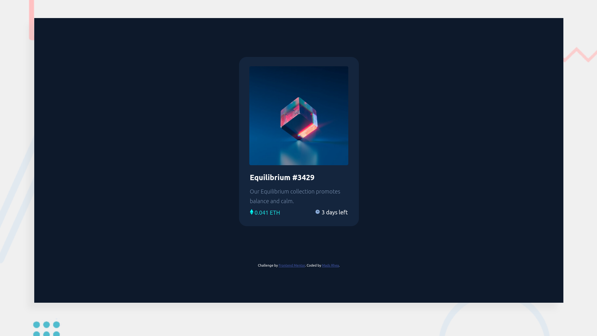

# Frontend Mentor - NFT preview card component solution

This is a solution to the [NFT preview card component challenge on Frontend Mentor](https://www.frontendmentor.io/challenges/nft-preview-card-component-SbdUL_w0U). Frontend Mentor challenges help you improve your coding skills by building realistic projects. 

## Table of contents

- [Overview](#overview)
  - [The challenge](#the-challenge)
  - [Example vs. Screenshot](#example-vs-screenshot)
  - [Links](#links)
- [My process](#my-process)
  - [Built with](#built-with)
  - [What I learned](#what-i-learned)
  - [Continued development](#continued-development)
- [Author](#author)

**Note: Delete this note and update the table of contents based on what sections you keep.**

## Overview

### The challenge

Users should be able to:

- View the optimal layout depending on their device's screen size
- See hover states for interactive elements

### Example vs. Screenshot 

The example given to build off of.

My replica of the example.

### Links

- Solution URL: [Add solution URL here](https://your-solution-url.com)
- Live Site URL: [Add live site URL here](https://your-live-site-url.com)

## My process

### Built with

- HTML
- CSS
- Visual Studio Code
- GIMP (for the abstract background)

### What I learned

Because I haven't touched HTML/CSS since I completed my _Web Development_ class over a year ago, and also decided to leave the assignment for the night before it was due, there was quite a bit of Googling and a lot of trial and error to remember what all the tags were.

But, I remembered my love of making websites (and coding in general) and remembered that, once it stops being frustrating, it starts being fun.

### Continued development

While I don't have any plans in the near future to continue working on it, I would love to come back and remake it once I'm more familiar with CSS. I know there's definitely a more efficent, less cluttered way to write the code and I'd love to compare and contrast once remaking.

## Author

- Github - [Mads Rhea](https://www.github.com/madsrhea)